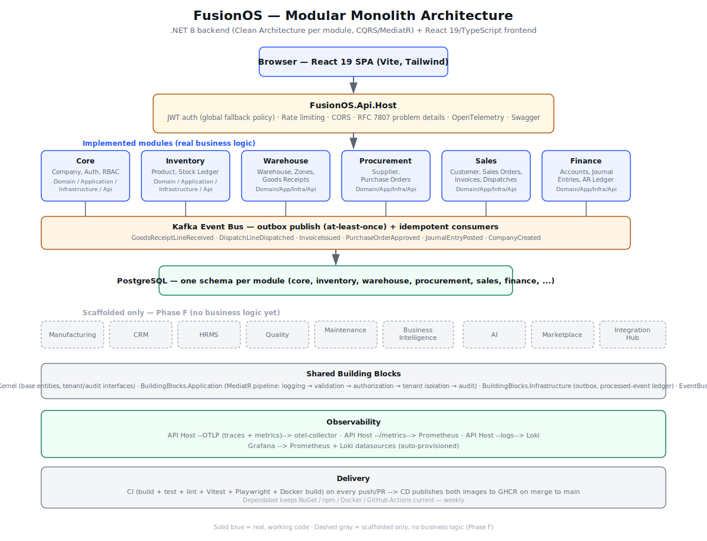
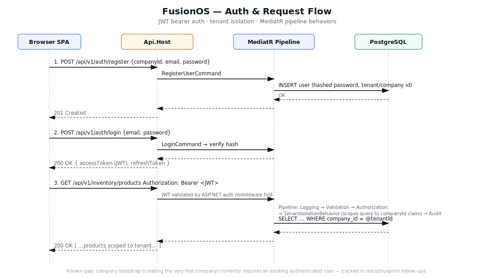

# FusionOS

An AI-first Enterprise Business Operating System — see `docs/blueprint/00_MASTER_CONTEXT.md`
for the full vision, and `docs/blueprint/` for the complete architecture/standards blueprint
(13 documents) that every module in this repo is built against.

**Do not start writing feature code without reading `docs/blueprint/00_MASTER_CONTEXT.md`
through `12_AI_PLATFORM.md` first** — that sequence is the binding source of truth for
architecture, database, API, security, coding, and AI-platform decisions.

## Repository layout

```
docs/blueprint/       13 blueprint documents (architecture, standards, roadmap) — read first
docs/DISASTER_RECOVERY.md  Backup/restore scripts + RPO/RTO status
backend/              .NET 8 modular monolith (Clean Architecture, CQRS/MediatR, EF Core/PostgreSQL)
frontend/             React + TypeScript + Vite + Tailwind (Vitest+RTL unit tests, Playwright E2E)
observability/        otel-collector, Prometheus, and Grafana/Loki config for docker-compose
scripts/               generate-migrations.sh, backup-postgres.sh, restore-postgres.sh
docker-compose.yml     Local dev stack: Postgres, Redis, Kafka, API, web, full observability stack
.github/workflows/     CI (build+test+lint+E2E+Docker build) and CD (image publish to GHCR)
.github/dependabot.yml Weekly dependency updates: NuGet, npm, Docker, GitHub Actions
```

## Architecture



Solid blue boxes are modules with real, working business logic; dashed gray boxes are Phase F
modules that are scaffolded (domain shell only, no business logic yet). See
`docs/blueprint/05_MODULE_ROADMAP.md` for the module-by-module status.

### Auth and request flow



Every request passes through JWT validation, then a MediatR pipeline (logging → validation →
authorization → tenant isolation → audit) before it ever reaches a database query — this is what
closes the cross-tenant data leak described in Phase A below.

**Update (2026-07-14 sprint audit):** the bootstrap deadlock previously called out here — a
brand-new deployment couldn't create its first company because `CompaniesController` required an
already-authenticated caller — is fixed. `POST /api/v1/core/companies` is now `[AllowAnonymous]`,
matching the fact `CreateCompanyCommand`'s handler was always permission-free by design ("the
bootstrap action of a fresh tenant"). The flow is now: create a company anonymously → register its
first (Owner) user anonymously (already worked) → log in → use the JWT for everything else.
`List`/`GetById` intentionally remain behind the default auth requirement. A related bug found in
the same audit — `GET /companies` had no tenant filter or permission gate, so any authenticated
user from any company could enumerate every company on the platform — is also fixed: it now
returns only the caller's own company. See `FusionOS_Sprint_Audit.docx` for the full audit this
came out of, including everything *not* yet fixed.

## What's actually implemented vs. scaffolded

This has grown well past the original Phase 0/1/2 scaffold. A 28-page enterprise audit was
run against the codebase (architecture, database, API, frontend/UX, security, DevOps, testing,
performance, AI/SAP/competitor positioning), and every critical/high-priority finding from that
audit's Phases A through E has since been remediated. Phase F (Manufacturing/AI-platform/SAP
migration) is explicitly out of scope for this remediation pass — see
`docs/blueprint/05_MODULE_ROADMAP.md` for when those modules' real business logic begins.

### Phase A — Security foundation (authentication was completely missing before this)

- Real user registration + BCrypt password hashing, JWT login (`AuthController`), and refresh-token
  issuance with rotation (opaque, SHA-256-hashed tokens, one-time use) — `Core` module.
- **Every endpoint requires an authenticated caller by default** (`AddAuthorization` with a global
  `FallbackPolicy`), with `[AllowAnonymous]` only on login/refresh/register (and now company
  creation — see the "Update" note above). Previously no controller had `[Authorize]` at all.
- `TenantIsolationBehavior` — a MediatR pipeline behavior that reflectively checks any request's
  `CompanyId` against the signed-in caller's own `CompanyId` claim, closing a cross-tenant data
  leak that existed as long as callers could pass any company id in a request body.
- Secrets out of source control: `Jwt:SigningKey`/`ConnectionStrings:Postgres` fail fast on startup
  outside Development if unset, rather than silently running with a placeholder.
- RFC 7807 `ProblemDetails` responses for every unhandled exception (`ProblemDetailsExceptionHandler`),
  replacing raw unhandled-exception stack traces.
- Frontend: a real login page + session store (`authStore.ts`, Zustand+persist), Bearer-token
  attachment with automatic 401→refresh-token retry (`shared/api/client.ts`), and a `RequireAuth`
  route guard — replacing the previous "no login screen at all" state.

### Phase B — Data-integrity and workflow bugs the audit's Database/Architecture pass found

- `AuditBehavior` no longer logs `EntityId = Guid.Empty` for every `Create*` command — it now
  reflectively reads the real id off the handler's response.
- Every EF configuration using the SQL-Server-only `.IsRowVersion()` idiom (21 files) now uses
  Postgres's actual concurrency mechanism, `UseXminAsConcurrencyToken()`.
- The one line-entity in the whole codebase missing a dedicated EF configuration
  (`JournalEntryLine`) now has one, matching its siblings' `numeric(19,4)` precision.
- `scripts/generate-migrations.sh` — generates the first real EF Core migration per module
  DbContext (still unverified in this sandbox; see "Verification" below).
- Finance test project + an integration-test scaffold (`FusionOS.IntegrationTests`,
  `WebApplicationFactory`-based) exist for the first time.

### Phase C — Cross-module workflow gaps + hardening

- **Procurement** now has a real Kafka consumer (`GoodsReceiptLineReceivedConsumer`) that advances
  a Purchase Order's received-status (`Draft → PartiallyReceived → FullyReceived`) when Warehouse
  posts a goods receipt — previously wired to publish but nothing consumed it.
- **Finance** has a minimal, honest Accounts Receivable ledger: `ArLedgerEntry`, fed by a real
  consumer (`InvoiceIssuedConsumer`) off Sales' `InvoiceIssued` event, with balance + ledger-history
  query endpoints. Payment/credit recording is explicitly out of scope for this slice (see the
  doc comment on `ArLedgerEntry`).
- **Rate limiting** (`AspNetCoreRateLimit`) — referenced but never configured before — is now wired
  with a global per-IP cap plus tight per-minute limits on the three unauthenticated Auth endpoints,
  mitigating brute-force login attempts.
- **Server-side search**: Product, Supplier, Customer, Warehouse, and Account list endpoints now
  accept a `search` query param (`EF.Functions.ILike` against 2 fields each), and the frontend's
  shared `EntityCombobox` debounces real search-as-you-type against it instead of fetching 200 rows
  and filtering client-side. Zone/SalesOrder/PurchaseOrder pickers are naturally scoped (single
  warehouse/company) and intentionally still use the old client-filter fallback — documented in
  `shared/api/entityOptions.ts`, not silently inconsistent.

### Phase D — Frontend UX/accessibility/performance + test coverage (previously near-zero)

- **Consolidated duplication**: 8 "Panel" components that each hand-rolled the same table/loading/
  empty-state markup now share one `DataTable` component (`shared/ui/DataTable.tsx`); `CrudListPage`
  composes it too.
- **Accessibility pass**: `EntityCombobox` now implements the real WAI-ARIA 1.2 combobox pattern
  (`role=combobox`/`listbox`/`option`, `aria-activedescendant`) with full Up/Down/Home/End/Enter/
  Escape keyboard support — previously mouse-only with zero ARIA semantics. `DataTable` headers get
  `scope="col"`; a skip-to-main-content link and `<main>` landmark were added to the app shell;
  form-level submission errors get `role="alert"`; the login form's fields get `aria-invalid`/
  `aria-describedby`.
- **Responsive**: the sidebar is now an off-canvas drawer below the `md` breakpoint (previously a
  fixed 256px column with no way to collapse it on a phone-sized viewport); all 12 two-column forms
  collapse to one column on narrow screens; `DataTable` wraps in a horizontally-scrolling container.
- **Code-splitting**: every route past `/login` is `React.lazy`-loaded with a shared `Suspense`
  boundary, instead of one monolithic bundle for the whole app.
- **Real test infrastructure, for the first time**: Vitest + React Testing Library (`happy-dom`
  environment — chosen over `jsdom` after `jsdom`'s much larger dependency tree repeatedly hit a
  real npm install limitation in this sandbox's mounted filesystem; not a reason to avoid `jsdom`
  on a normal machine) covering `EntityCombobox`, `DataTable`, `Button`, and `useDebouncedValue`.
  A Playwright E2E scaffold (`playwright.config.ts`, `e2e/login.spec.ts`) covers the login/
  routing-guard flow. See "Verification" below for what could and couldn't actually be *run* here.

### Phase E — Observability, backup/DR, and delivery pipeline (none of this existed before)

- **Traces + metrics** now actually export somewhere: `Program.cs` previously registered ASP.NET
  Core trace instrumentation with **no exporter at all** (every trace was computed and discarded).
  It now exports OTLP traces + metrics (plus .NET runtime metrics — GC, thread pool, exceptions) to
  an `otel-collector` service, and separately exposes a Prometheus scrape endpoint at `/metrics`.
- **Logs → Grafana Loki**, in addition to the console, via `Serilog.Sinks.Grafana.Loki`.
- `docker-compose.yml` gained `otel-collector`, `prometheus`, `loki`, and `grafana` services, with
  Grafana's Loki + Prometheus datasources auto-provisioned (`observability/grafana/provisioning`).
- **Backup/DR**: `scripts/backup-postgres.sh` (`pg_dump --format=custom`, timestamped, with
  retention pruning) and `scripts/restore-postgres.sh`. `docs/DISASTER_RECOVERY.md` states plainly
  what this does and doesn't cover, and that nobody has run a restore drill yet — treat the RPO/RTO
  numbers there as unverified until someone does.
- **CD**: a new `.github/workflows/cd.yml` builds and pushes both Docker images to GitHub Container
  Registry on every merge to `main`, tagged with the commit SHA and `latest`. It stops at "the
  images are published" — there is no live environment yet for it to deploy into.
- **Dependabot** (`.github/dependabot.yml`): weekly updates for NuGet, npm, Docker base images, and
  the GitHub Actions themselves — previously nothing kept any of these current.
- CI (`.github/workflows/ci.yml`) now also runs the frontend's unit tests (`npm test`) and a
  Playwright E2E smoke job, in addition to the pre-existing backend build+test and Docker build jobs.

### What was already there (Phase 0/1/2, unchanged in shape by this remediation pass)

- **Core**: Company, Branch, Department, User, Role, Permission, RolePermission, UserCompanyRole,
  AuditLog, Notification — full CRUD vertical slice for Companies.
- **Inventory**: Product + an append-only Stock Ledger (stock adjustments, stock-on-hand queries).
- **Warehouse**: Warehouse + Zones + Goods Receipts.
- **Procurement**: Supplier + Purchase Orders (Draft → Approved → Partially/Fully Received).
- **Sales**: Customer + Sales Orders (Draft → Confirmed) + Invoices (Draft → Issued) + Dispatches.
- **Finance**: Chart of Accounts + General Ledger Journal Entries (Draft → Posted, must balance).
- **Cross-module eventing**: Kafka outbox-publish + idempotent consumer infrastructure, actually
  running (registered as hosted services) — Inventory's Stock Ledger is credited/debited off
  Goods Receipt / Dispatch events; Procurement and Finance now consume events too (Phase C, above).
- Every other module (Manufacturing, CRM, HRMS, Quality, Maintenance, Business Intelligence, AI,
  Marketplace, IntegrationHub) remains **structurally scaffolded only** — all four layers exist,
  each has its own DbContext/schema and a `/api/v1/{module}/health` endpoint, but no business logic.
  This is Phase F territory and was explicitly excluded from this remediation pass.

## Sprint audit (2026-07-14)

A brutal, adversarial code-level audit was run against every module in this repo, benchmarked
against SAP/Oracle/Dynamics 365/Odoo/ERPNext/NetSuite/Infor. Full results — a module-by-module
scorecard, PRD comparison, enterprise feature gap list, security/performance scoring, production
readiness percentages, and a prioritized remaining-work backlog — are in `FusionOS_Sprint_Audit.docx`
at the repo root. Headline findings:

- Overall completion against the full 26-module/capability scope: **~15%**. Production readiness:
  **~8%**. Six modules (Core, Inventory, Warehouse, Procurement, Sales, Finance) have real business
  logic; the other 20 are scaffold-only or entirely missing.
- **Two launch-blocking defects were found and one class of them fixed in this pass**: (1) zero EF
  Core migrations exist anywhere in the repo — a fresh deployment cannot create its database schema
  at all, still unresolved, needs a machine with the .NET SDK; (2) the auth bootstrap deadlock —
  **fixed**, see the "Update" note under Architecture above.
- A confirmed cross-tenant data leak (`GET /companies` had no tenant scoping) was also **fixed**
  in this pass.
- Everything else the audit found — RBAC gating writes only, no role administration UI, dead
  `GetById` stubs across six controllers, zero costing methods in Inventory, no real WMS in
  Warehouse, AR being charge-only in Finance, and the full enterprise-feature gap list (batch/serial
  tracking, MRP/BOM, approval matrix, GST, bank reconciliation, financial statements, and more) —
  is documented with file-path evidence and a prioritized backlog in `FusionOS_Sprint_Audit.docx`,
  not yet fixed.

## Running it

### Prerequisites (install once)

- **Docker Desktop** — https://www.docker.com/products/docker-desktop/ (provides the `docker` command)
- **.NET 8 SDK** — https://dotnet.microsoft.com/download/dotnet/8.0 (provides the `dotnet` command)
- **Node.js 20+** — https://nodejs.org (provides `npm`)
- **EF Core CLI tool**, one time after installing the SDK: `dotnet tool install --global dotnet-ef`

If you're on Windows PowerShell (not PowerShell 7+), don't chain commands with `&&` — either put
them on separate lines/separate terminal calls, or use `;`.

### 1. Start infrastructure

```
docker compose up -d postgres redis kafka
```

Add the observability stack too if you want it (`otel-collector`, `prometheus`, `loki`, `grafana`):

```
docker compose up -d otel-collector prometheus loki grafana
```

Then open Grafana at http://localhost:3000 (`admin`/`admin`) — Loki and Prometheus datasources are
already provisioned. Point the API at both by setting `Observability__OtlpEndpoint=http://otel-collector:4317`
and `Observability__LokiUrl=http://loki:3100` (already set automatically when you run the `api`
service via `docker compose up`; set them yourself if running the API with `dotnet run` instead).

### 2. Create and apply the database migrations

Run `./scripts/generate-migrations.sh` (see the script header — generates `InitialCreate` for
every module with real EF configurations), then `./scripts/generate-migrations.sh --apply` or the
`dotnet ef database update` commands it prints, per module. **This step has never actually been
run against a real Postgres instance — see the Sprint Audit note above; treat it as the single
highest-priority thing to verify before relying on anything else in this README.**

### 3. Run the API (from `backend/`)

```
dotnet run --project src/Host/FusionOS.Api.Host
```

### 4. Run the frontend (in a separate terminal, from the repo root)

```
cd frontend
npm install
npm run dev
```

Or skip all of the above and bring up everything containerized: `docker compose up --build` (this
still requires the migrations from step 2 to have been applied at least once).

### Frontend tests

```
cd frontend
npm test           # Vitest + React Testing Library, one-shot
npm run test:watch # same, watch mode
npm run test:e2e   # Playwright — starts its own dev server, needs `npx playwright install` once
```

### Frontend preview (no backend required)

The frontend alone is deployed as a static preview on Vercel: **https://fusionos-frontend.vercel.app**.
Every screen renders and is navigable, but API calls will fail with no backend hosted anywhere yet.

## Verification in this environment — what's real, what's static-only

This entire remediation pass was built in a sandbox with **no `dotnet`, `docker`, or `nuget`
binaries** and, as of this round, an unreliable `npm install` for large multi-file packages (a
cross-filesystem mount issue — see below). Everything claimed as "verified" below was actually run;
everything else is static review only, and you should not trust it further than that.

**Backend — static-only, never actually compiled here.** Every `.csproj` was checked for
well-formed XML, every `.cs` file for balanced braces/parens, every `appsettings*.json` for valid
JSON. `dotnet restore && dotnet build && dotnet test` (or just open a PR — CI does this
automatically) is the real verification; do that before trusting any backend claim in this README.

**Frontend TypeScript — genuinely verified.** `npx tsc -b --force` was run repeatedly throughout
this pass (including on every new test file and config added in Phase D/E) and returns zero errors.
This is a real, reliable check in this sandbox (unlike `tsc --noEmit` alone, which misses some
project-reference errors).

**Frontend bundling (`vite build` / `vitest run` / `playwright test`) — could not be executed in
this specific sandbox.** This Vite 8 project uses `rolldown-vite` under the hood, which needs a
native binary (`@rolldown/binding-linux-x64-gnu`). In earlier rounds that binary was simply missing
(a clean, harmless `MODULE_NOT_FOUND`, irrelevant to your own machine). This round it was installed,
but the binary itself **segfaults on invocation in this sandbox** (`npx vite --version` alone
crashes with "Bus error") — a native-code/environment incompatibility specific to this container,
not a defect in the source. Since Vitest and Playwright's dev-server both go through Vite, neither
could actually run here either. On a normal machine (including your Windows one) this is expected
to work; `npx tsc -b --force` passing cleanly on every test file is the best available substitute
verification done here.

**A real, separate npm limitation surfaced this round**, worth knowing about if you hit it: this
sandbox's copy of the repo lives on a cross-OS mounted filesystem, and npm's install strategy
(rename-to-temp-then-delete for every package it touches) intermittently fails with `ENOTEMPTY` /
`EPERM` on that mount for packages with many files (`jsdom` reliably triggered this; smaller
packages like `happy-dom` mostly didn't). If you ever see `npm install` fail this way, it is a
property of *this* sandbox's filesystem, not the repo — a normal Linux/macOS/Windows filesystem
does not have this problem. It was worked around here by installing into a scratch directory
outside the mount and copying the result into `node_modules`.

Two real bugs were caught by careful review specifically *because* the backend can't compile
here and needed extra scrutiny: `OutboxDispatcher`/`KafkaConsumerHostedService` were fully
implemented in an earlier round but never registered as hosted services (so neither had ever
actually run), and every module's `*.Api.csproj` was missing a project reference to
`FusionOS.BuildingBlocks.EventBus` despite using its types. Both are fixed. This is a concrete
reminder that `dotnet build` locally is the only real backend verification — brace-balance
checking cannot catch either of those classes of bug. The same discipline caught two more bugs
in the 2026-07-14 sprint audit (the auth bootstrap deadlock and the `GET /companies` cross-tenant
leak, both fixed) — see `FusionOS_Sprint_Audit.docx` for everything it found that isn't fixed yet.

## Next steps

1. Run `dotnet build`/`dotnet test` locally or via CI to confirm the backend as shipped compiles
   cleanly; fix anything CI surfaces (see "Verification" above for why this hasn't happened here).
2. Run `npm run build`, `npm test`, and `npm run test:e2e` on a real machine to confirm the frontend
   bundles and the new test suites actually pass (see "Verification" above for why this sandbox
   couldn't run them despite `tsc` passing clean).
3. Generate and apply real EF Core migrations (`scripts/generate-migrations.sh`) — nothing in this
   repo has ever been run against a real schema; this is the single highest-priority gap per the
   2026-07-14 sprint audit.
4. Run an actual restore drill against `scripts/backup-postgres.sh`/`restore-postgres.sh` and record
   real RPO/RTO numbers in `docs/DISASTER_RECOVERY.md` — nobody has run one yet.
5. Point `otel-collector`'s trace/metric pipelines at a real backend (Tempo, a hosted OTLP vendor,
   etc.) instead of the `debug` exporter it uses today — see `observability/otel-collector-config.yaml`.
6. Ship the Payments/Credits half of Finance's Accounts Receivable ledger (Phase C added
   charge-only entries); add Accounts Payable, GST/Taxes, cost centers, bank reconciliation, and
   trial-balance reporting.
7. Add server-side search for the three remaining EntityCombobox pickers (Zone, Sales Order,
   Purchase Order) if their list sizes ever outgrow single-company/single-warehouse scope.
8. Continue Phase 1 depth per module (Inventory variants/batch tracking, Warehouse put-away/picking/
   packing, Procurement RFQ/vendor returns, Sales Quotations/Returns/Credit Notes/price lists), then
   Phase F (Manufacturing, AI platform, SAP migration) once ready.
9. Build RBAC role/permission administration (currently every user is an all-permissions "Owner")
   and gate read/query endpoints on permissions, not just writes — see `FusionOS_Sprint_Audit.docx`.
